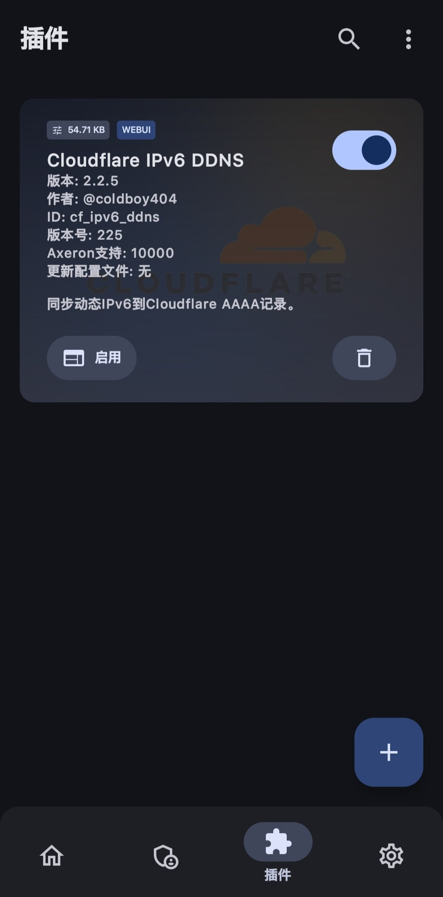
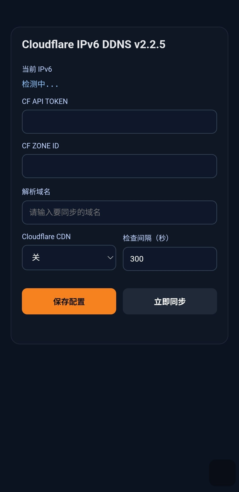

# Cloudflare IPv6 DDNS（AxManager 插件）

一个为 **AxManager** 设计的 Cloudflare 动态 IPv6 同步插件：
自动检测设备当前 IPv6，并更新到 Cloudflare 的 `AAAA` 记录。

ps:用途很广泛，其中一个用途就是在被控手机上安装AxManager和本插件，并在AxManager里设置好开机自启关闭电池优化，然后随时随地通过公网域名和无线ADB远程控制另一台手机，仅供参考，各位可自行发挥

## 🔗 项目链接
- 本插件仓库：<https://github.com/coldboy404/AxManager-ipv6-ddns>
- AxManager：<https://github.com/fahrez182/AxManager>

## 🖼️ 界面预览

### 插件卡片

### WebUI

## ✨ 功能特性
- 自动检测并同步 IPv6 到 Cloudflare `AAAA`
- 网络切换（Wi-Fi / 移动数据）场景更稳
- 支持 Cloudflare CDN 开关（`CF_PROXIED`）
- 内置 WebUI 配置
- 支持插件卡片背景图（`banner=image.jpg`）
- 记录不存在时自动创建 AAAA 记录

## ⚙️ WebUI 配置项
在插件 WebUI 中填写：
- `CF API TOKEN`（需具备 Zone DNS 编辑权限）
- `CF ZONE ID`
- `解析域名`（如：`home.example.com`）
- `Cloudflare CDN`（开/关）
- `检查间隔（秒）`

> `CF ZONE ID` 为必填项。

## 🧠 同步逻辑（简述）
- 插件启用后由 `service.sh` 按间隔执行（默认 300 秒）
- 主脚本：`system/bin/ddns.sh`
- 仅在 IPv6 变化时更新记录
- 若目标 AAAA 不存在则自动创建

## 📁 运行目录与日志
- 运行目录：`/sdcard/Android/media/cf_ipv6_ddns`
- 配置文件：`/sdcard/Android/media/cf_ipv6_ddns/config.env`
- 日志文件：`/sdcard/Android/media/cf_ipv6_ddns/ddns.log`